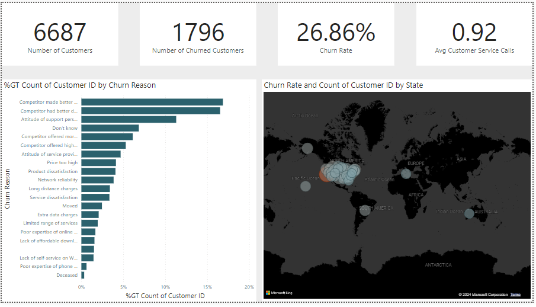
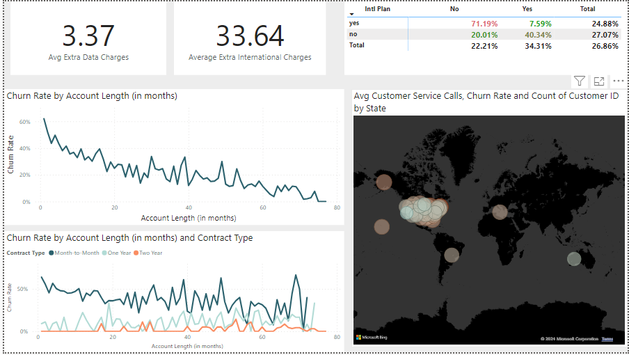
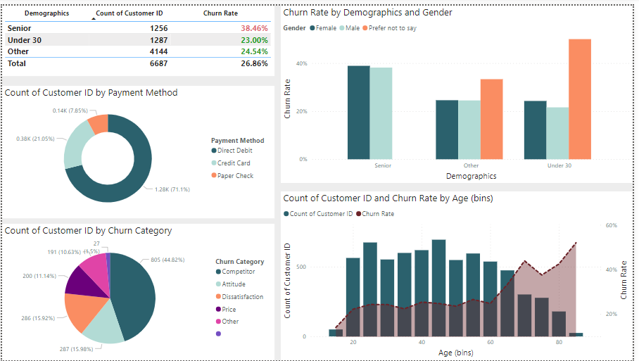
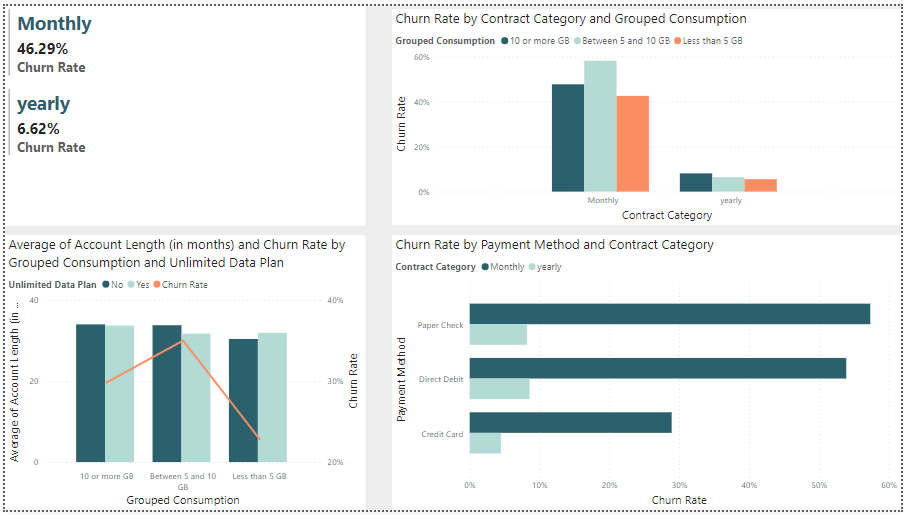
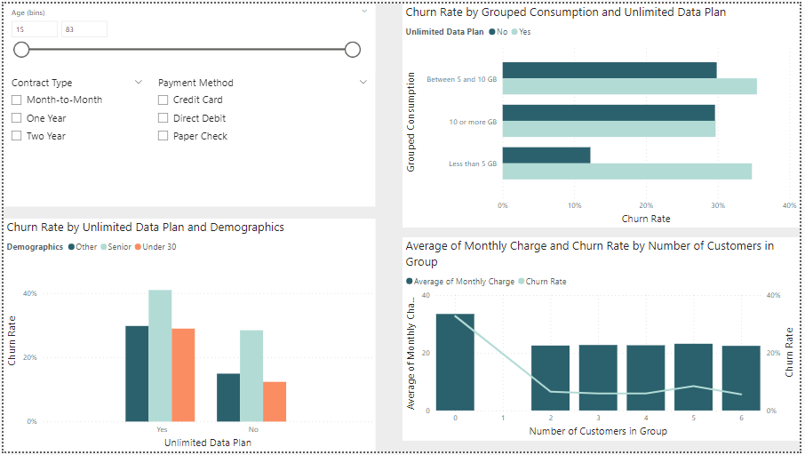

# 📉 Customer Churn Analysis Dashboard

### 🎯 Project Overview
The goal of this project is to analyze customer behavior and identify the key factors leading to **Churn**. By understanding why customers leave, the company can take proactive steps to improve retention and reduce financial losses.

---

### 🛠️ Data Engineering & DAX
I performed data modeling and created several key metrics using **DAX (Data Analysis Expressions)** to provide deeper insights into the dataset.

#### 📊 Key Measures Created:
*   **Total Customers:** Total count of the customer base.
*   **Churned Customers:** Number of customers who left the service.
*   **Churn Rate %:** The percentage of customers lost (Critical Business Metric).
*   **Avg Customer Service Calls:** Monitoring support interactions.
*   **Extra Charges Analysis:** Calculated average extra charges for **Data** and **International** usage.

#### 📁 Computed Columns (Feature Engineering):
*   **Contract Type:** Segmented customers into **"Yearly"** and **"Monthly"** contracts to analyze loyalty.
*   **Demographics:** Categorized customers by age groups (**"Seniors"**, **"Under 30"**, and **"Other"**).
*   **Grouped Consumption:** Divided customer usage into **3 distinct categories** for better targeting.

---

### 🔍 Analysis & Insights
I conducted a deep dive into the data to uncover the "Why" behind the churn:
*   **Age-Based Churn:** Analyzed which age groups are most likely to leave.
*   **Financial Impact:** Investigated the correlation between high **Data Charges** and churn rate.
*   **International Usage:** Compared churn rates between customers who use international plans vs. those who don't.
*   **Root Cause Discovery:** Identified specific patterns that help the company understand the drivers of customer attrition.

---

### 🛠️ Tech Stack
*   **Tool:** Power BI
*   **Language:** DAX (Data Analysis Expressions)
*   **Focus:** Descriptive & Diagnostic Analysis

---

### 📸 Dashboard Preview

