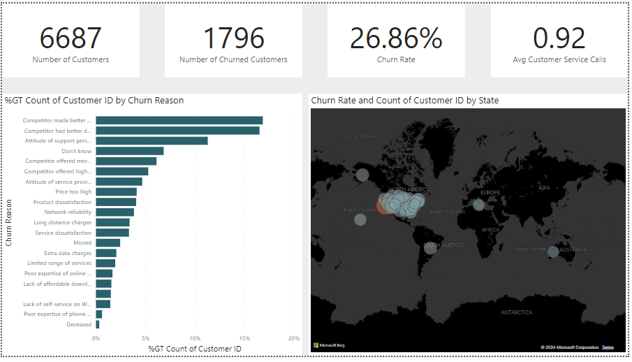
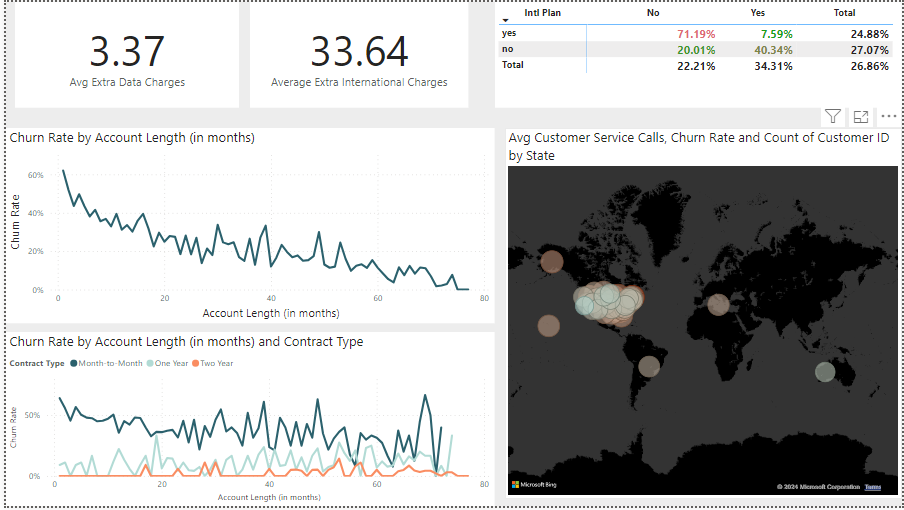
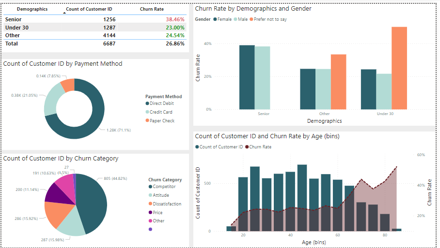
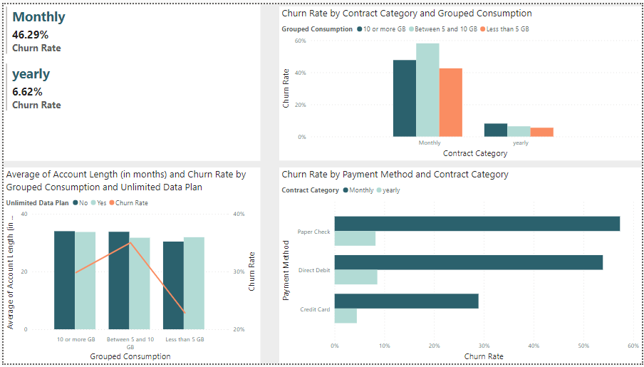
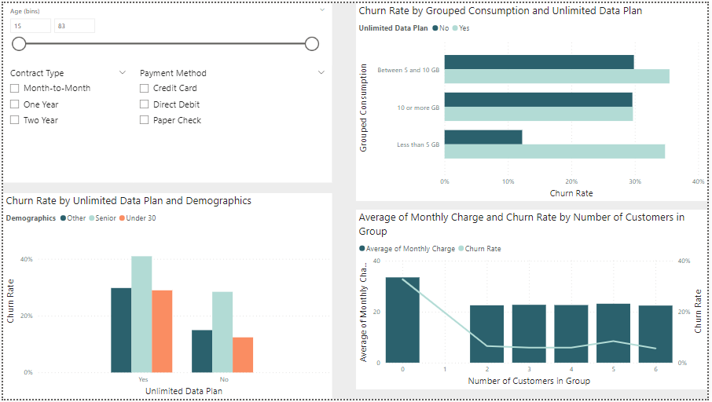

# Customer Churn Analysis Dashboard

> A Power BI case study that moves from a headline churn rate to the customer behaviors and service patterns behind it.

## Business question

Why are customers leaving, which segments are most exposed, and what signals can a retention team use to decide where to act first?

## What I built

I modeled the customer dataset in Power BI, created custom DAX measures, added business-friendly segments, and organized the report around descriptive and diagnostic views.

### Key measures

- Total customers
- Churned customers
- Churn rate %
- Average customer service calls
- Average extra data charges
- Average extra international charges

### Feature engineering

- Contract category: Monthly vs. Yearly
- Demographic groups: Seniors, Under 30, and Other
- Grouped consumption: Less than 5 GB, Between 5 and 10 GB, and 10 GB or more

## Analytical views

The report connects churn to age, contract type, data consumption, international usage, payment method, account length, customer service calls, and stated churn reason.

## Selected findings

- The dataset contains **6,687 customers**, including **1,796 churned customers**.
- The overall churn rate is **26.86%**.
- Monthly contracts show a much higher churn rate than yearly contracts, making contract type a useful retention lens.
- Competitor-related reasons and service experience patterns are prominent in the churn-reason breakdown.

## Tools

- Microsoft Power BI
- DAX
- Data modeling
- Feature engineering
- Descriptive and diagnostic analysis

## Dashboard preview

## Portfolio case study

Read the full visual case study on my [portfolio website](https://yarabi-nd6zeztr.manus.space/projects/power-bi/churn-rate-analysis).
