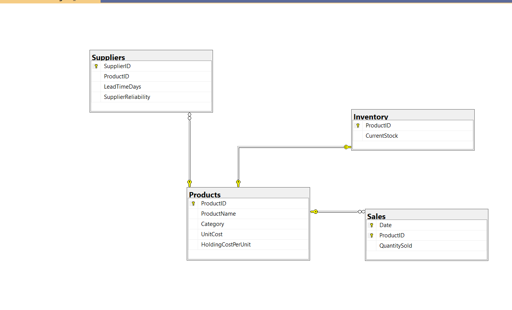
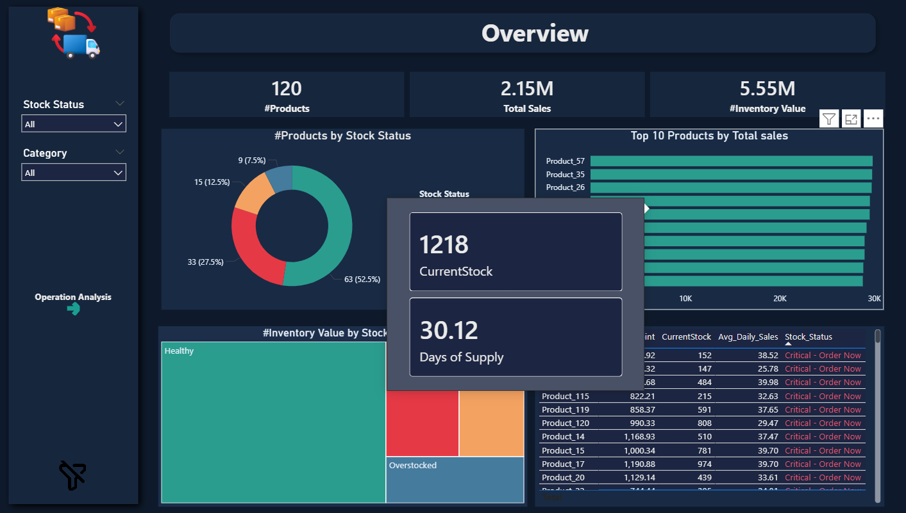
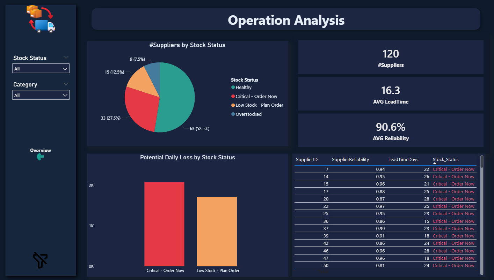
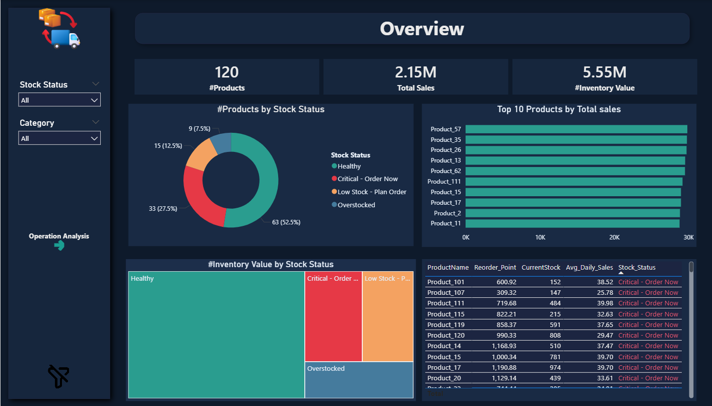

# 📊 Supply Chain Dashboard (End-to-End Analysis)

### 🎯 Project Overview
The primary goal of this project was to establish a robust connection between **SQL Server** and **Power BI** to analyze supply chain efficiency. By leveraging SQL for heavy data processing, I ensured high performance and data integrity, providing actionable insights for business decision-making.

---

### ⚙️ Project Workflow
1. **Data Ingestion:** Imported raw CSV files into **SQL Server**.
2. **Data Transformation (SQL-Centric):** I performed complex transformations and feature engineering directly in SQL (instead of Power Query). This approach ensures:
   - Faster dashboard performance.
   - "Analysis-ready" tables available at all times.
3. **Visualization:** Used **Power BI** to design an interactive dashboard that translates raw data into strategic insights.

---

### 💡 Key Business Insights & Solutions

#### 1. 🩺 Inventory Health Monitoring
I calculated the **Days of Supply** for each product to categorize inventory status:
*   **Critical:** Products at risk of running out.
*   **Overstock:** Excess products that freeze company liquidity.

#### 2. 🔗 Supply Chain & Sales Integration
To ensure the stock is replenished at the perfect time, I calculated the **Reorder Point** by analyzing:
*   **Avg Daily Sales** vs. **Supplier Lead Time**.
*   This prevents both stockouts and excessive storage costs.

#### 3. ⚠️ Supplier Risk Assessment
I evaluated supplier performance based on two metrics:
*   **Lead Time Speed:** How fast they deliver.
*   **Reliability:** Compliance with delivery schedules.
*   *Result:* Identifying which suppliers pose a risk to the supply chain continuity.

#### 4. 💰 Financial Impact Measurement
Converted operational metrics into financial data by calculating the **Potential Daily Loss** for out-of-stock items. 
> *“Speaking the language of finance helps stakeholders make faster, data-driven decisions.”*

---

### 🛠️ Tech Stack
*   **Database:** SQL Server (T-SQL for queries and transformations).
*   **BI Tool:** Power BI (Data Modeling & Visualization).
*   **Data Source:** CSV Files.

---

### 📸 Dashboard Preview

